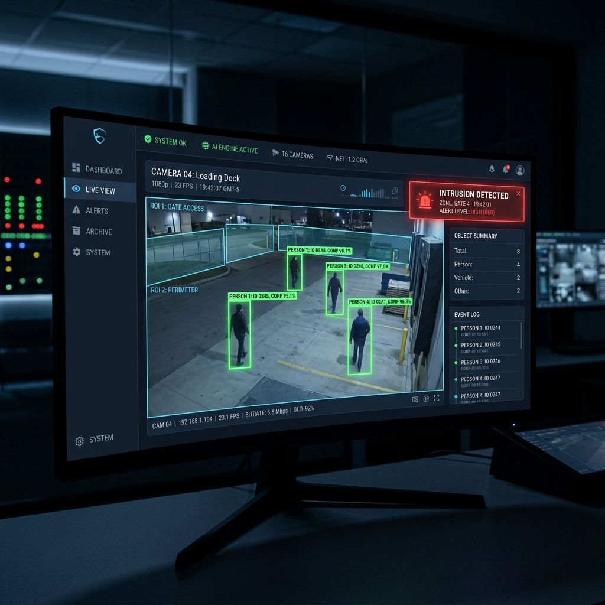

# COGNIVIEW
**Real-Time AI-Powered Surveillance System**

COGNIVIEW is an intelligent, real-time video surveillance prototype built with Python, OpenCV, and Ultralytics YOLOv8. It identifies persons in live webcam feeds or recorded videos, flags when they enter user-defined restricted zones (ROIs), and filters false alarms using temporal, confidence, and cooldown metrics. Confirmed intrusions are automatically logged and saved as timestamped, annotated images.

---

## 🚀 Features
- **Real-Time Detection:** Uses YOLOv8n (nano) for high-speed person detection.
- **ROI Intrusion Logic:** Define restricted zones (Regions of Interest) where people shouldn't be.
- **Smart Filtering:** Mitigates false positives with confidence scoring, continuous frame tracking (temporal filtering), and alert cooldown windows.
- **Automated Logging:** Saves annotated PNG frames and detailed CSV logs upon intrusion detection.
- **Live Output:** Displays a real-time HUD with FPS, object counts, bounding boxes, and alert status.
- **Headless Mode:** Run benchmarks or server-side processing without a GUI window.

## 📸 Sample Output


*Figure 1: Example of the real-time detection interface with HUD overlays and intrusion alerts.*


## 🛠️ Installation

**Requirements:** Python 3.9+

1. **Clone or Extract the Project:**
   Ensure you are in the `cogniview` directory.

2. **Create a Virtual Environment (Optional but Recommended):**
   ```bash
   python -m venv venv
   # Windows:
   .\venv\Scripts\activate
   # Linux/Mac:
   source venv/bin/activate
   ```

3. **Install Dependencies:**
   ```bash
   pip install -r requirements.txt
   ```
   *Note: This will download `ultralytics`, `kaggle`, and PyTorch which may take several minutes depending on your connection.*

## 📊 Kaggle Dataset Setup

To test the system against real-world data like the UCF Crime dataset, you can use the Kaggle API. **Never expose your API credentials in source code or configs.**

1. **Get your API Key:**
   Go to [Kaggle](https://www.kaggle.com/) -> Account Settings -> "Create New Token". This downloads a `kaggle.json` file.

2. **Place the Key Safely (Windows):**
   Move the `kaggle.json` file to your user profile directory:
   ```cmd
   C:\Users\<USERNAME>\.kaggle\kaggle.json
   ```

3. **Download and Extract Dataset:**
   Open your terminal in the `cogniview` directory and run:
   ```bash
   # Download the dataset (may take a while)
   kaggle datasets download -d mission-ml/ucf-crime-dataset

   # Extract to the required folder (using PowerShell)
   Expand-Archive -Path ucf-crime-dataset.zip -DestinationPath data/kaggle/ucf_crime/ -Force
   
   # You can delete the zip after extraction
   Remove-Item ucf-crime-dataset.zip
   ```

## 🎥 Usage

Run the main script to start the system:
```bash
python main.py
```

**Custom Arguments:**
- `--source`: Specify the video source (e.g., `0` for webcam, or `"data/kaggle/ucf_crime/Abuse/Abuse028_x264.mp4"` for a file).
- `--config`: Specify a custom configuration file (default is `config.yaml`).
- `--equalise`: Enable histogram equalisation for low-light enhancement.
- `--headless`: Run the pipeline without opening a display window (results are still logged).

**Example:**
```bash
# Run with webcam
python main.py --source 0

# Run in headless mode for benchmarking
python main.py --source "data/kaggle/ucf_crime/Abuse/Abuse001_x264.mp4" --headless
```

*Press `q` at any time to exit the live window safely.*

## ⚙️ Configuration

Tune the system via `config.yaml`. No hardcoded thresholds are present in the Python code.

- **`source`**: The input video feed (integer or file path).
- **`resolution`**: The required video processing resolution.
- **`preprocessing.equalise_histogram`**: Contrast enhancement.
- **`model.path`**: Path to the YOLOv8 weights (auto-downloads if missing).
- **`filters`**: Tune detection rules here:
  - `confidence_threshold`: Minimum confidence score (0.0 - 1.0).
  - `frame_threshold`: How many consecutive frames an object must stay in an ROI to trigger an alert.
  - `cooldown_seconds`: Minimum time between alerts.
- **`rois`**: Define restricted zones via pixel coordinates (`x1, y1, x2, y2`).

## 📂 Project Structure

- `main.py`: The orchestrator script running the core pipeline loop.
- `video_input.py`: Manages video sources via OpenCV.
- `preprocessing.py`: Handles resizing, color conversion, and image enhancement.
- `detection.py`: Manages the YOLOv8 model and logic.
- `intrusion.py`: Computes Region of Interest (ROI) logic and bounding box overlaps.
- `filtering.py`: Applies temporal, cooldown, and confidence filtering.
- `alert.py`: Handles saving images and writing log records.
- `visualization.py`: Renders bounding boxes, ROIs, and the HUD to the live window.

## 🧪 Testing

We recommend testing the system against the Kaggle UCF Crime dataset. To avoid massive repo sizes, datasets are omitted and must be downloaded manually using the instructions in the **Kaggle Dataset Setup** section. 

Once downloaded, you can run tests using the CLI:
```bash
# Test Intrusion/Abuse Scenario
python main.py --source "data/kaggle/ucf_crime/Abuse/Abuse028_x264.mp4"

# Test Normal Baseline Scenario
python main.py --source "data/kaggle/ucf_crime/Normal_Videos_event/Normal_Videos_003_x264.mp4"
```

---
*Created as a prototype development project.*
